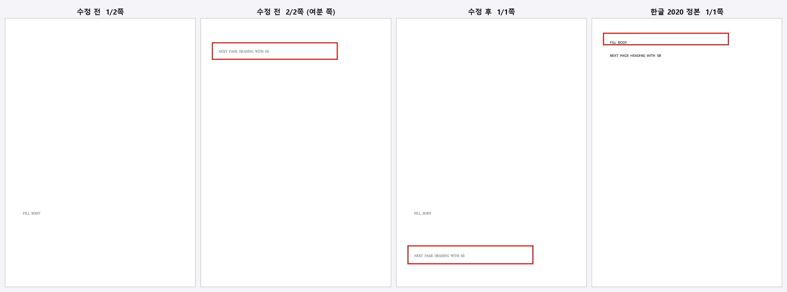

# task_m100 #5921 처리 결과 — 저장 near-top 리셋이 직전 쪽 잔여 공간을 안 보고 쪽을 가르던 결함

- 이슈: [#5921](https://github.com/edwardkim/rhwp/issues/5921)
- 대상 문서: `samples/task2136/neartop_reset_sb2500.hwpx`
- 정답지: `pdf/task2136/neartop_reset_sb2500-2020.pdf` (한글 2020, **1쪽**)
- 기준 커밋: `b9eb55107` (origin/devel)
- 변경 파일: `src/renderer/typeset.rs`(2곳), `tests/fixtures/render_page_samples.tsv`(1행),
  `tests/issue_2136_neartop_reset_sb2500.rs`(정본 기준으로 재작성), `samples/task2136/README.md`

## 1. 증상

`neartop_reset_sb2500.hwpx` 를 렌더하면 rhwp 는 **2쪽**을 낸다. 같은 문서의 한글 2020
정본은 **1쪽**이고 두 문단이 모두 1쪽에 있다.

저장소 자기 정답지도 이미 같은 말을 하고 있었다 — `tests/fixtures/render_page_samples.tsv:249`

```
rel                                        	hangul_pages	rhwp_pages_baseline	delta
samples/task2136/neartop_reset_sb2500.hwpx 	1           	2                  	1
```

즉 `delta=+1` 로 등록된, 알려진 쪽수 초과다.

## 2. 실측

`rhwp dump-pages` (origin/devel `b9eb55107`)

```
=== 페이지 1 ===  body_area h=933.6
  단 0 (items=1, used=853.3px)
    FullParagraph  pi=0  h=853.3  vpos=0  ls=1[lh=64000]  "FILL BODY"
=== 페이지 2 ===
  단 0 (items=1, used=63.2px)
    FullParagraph  pi=1  h=63.2 (sb=33.3 lines=29.9)  vpos=2500  ls=1[lh=1400 gap=840]  "NEXT PAGE HEADING WITH SB"
```

| 항목 | 값 |
|---|---|
| 본문 높이 | 933.6 px (= 70,018 HU) |
| pi0 저장 흐름 하단 | 853.3 px (= 64,000 HU) |
| **1쪽 잔여** | **80.3 px (= 6,018 HU)** |
| **pi1 필요 높이** | **63.2 px** (sb 33.3 + 줄 29.9) |

`63.2 ≤ 80.3` — pi1 은 저장 흐름 그대로도 1쪽에 들어간다. 그런데도 쪽이 갈렸다.

정본 좌표(PyMuPDF): 두 줄 모두 1쪽, `y=70.7pt` / `y=111.7pt` (본문 상단 70.85pt).

## 3. 원인

`src/renderer/typeset.rs` 의 `native_near_top_reset` — 문단간 저장 vpos 리셋을
쪽 경계로 승격시키는 판정.

```rust
let native_near_top_reset = !hwp3_origin_page_tolerance
    && cv > 0
    && cv <= 2500                                  // ← #2136 이 2000 에서 넓힌 상한
    && para_sb_hu_for_reset > 0
    && (cv - para_sb_hu_for_reset).abs() <= 150
    && !shape_only_para
    && !has_table_control
    && para_has_visible_text(para)
    && prev_vpos_end > 60_000;
```

pi1 은 `cv=2500`, `sb=2500HU`(정확 일치), `prev_vpos_end=64,000 > 60,000` 이라 모든 항을
통과해 **무조건 쪽 경계**가 된다.

빠져 있는 것은 **"직전 쪽에 자리가 남았는가"** 다. `prev_vpos_end > 60_000` 은 용지·여백과
무관한 절대 상수라서, 본문이 70,018HU 인 이 문서에서 하단으로부터 6,018HU(=80.3px)나
남은 지점을 "쪽 하단"으로 오인한다.

한글은 저장된 `linesegarray` 를 쪽 경계의 최종 근거로 쓰지 않고 다시 조판한다. `cv≈sb` 는
"새 쪽 상단"의 신호일 수 있지만, **그 문단이 직전 쪽 저장 흐름에 그대로 들어가는 경우**
그것은 쪽 경계가 아니다 — 들어가는데 넘길 이유가 없기 때문이다. 실제로 상한을
2000→2500 으로 넓힌 #2136 의 근거 문서(148753276 pi46)는 `used 942px > 본문 933.6px` 로
**과적(넘침)** 이 확인된 경우였다. 지금 코드는 넘치는 경우와 남는 경우를 구분하지 못한다.

## 4. 수정

확장 구간 `2000 < cv <= 2500` 에 한해 잔여 공간 항을 더한다.

```rust
let native_reset_fits_prev_page = body_height_hu_native > 0
    && para.line_segs.first().is_some_and(|seg| {
        prev_vpos_end
            .saturating_add(para_sb_hu_for_reset)
            .saturating_add(seg.line_height)
            <= body_height_hu_native
    });
let native_reset_extension_misfire = cv > 2000 && native_reset_fits_prev_page;
```

`native_near_top_reset` 의 마지막 항에 `&& !native_reset_extension_misfire` 를 더했다.
`body_height_hu_native` 는 `page_def.height − (상·하 여백 + 머리말·꼬리말 여백)` 로,
기존 `body_height_hu_for_variant` 가 hwp3 프로필에서만 값을 갖도록 계산되어 있어
네이티브 경로용으로 따로 뒀다(기존 소비처 동작 불변).

**왜 `cv > 2000` 으로 좁혔나.** 처음에는 구간 제한 없이 잔여 공간 항만 걸었더니
`samples/basic/sungeo.hwp` 가 94쪽 → 91쪽으로 **회귀**했다. 그 문서의 pi63 은
`cv=400`(종전 구간)이고 잔여 28.5px 에 필요 24.0px 로 아슬아슬하게 "들어가는" 형상이지만
한글은 거기서 쪽을 가른다. 종전 `cv <= 2000` 구간에는 이런 빠듯한 진짜 경계가 들어 있으므로
손대지 않고, **#2136 이 새로 넓힌 구간만** 자기 근거(과적)를 요구하도록 했다.
근거 문서 148753276 pi46 은 과적이라 이 항이 거짓 → 종전 동작 그대로다.

## 5. 검증

### 5.1 대상 문서

| | 쪽수 | 1쪽 used | pi1 위치 |
|---|---|---|---|
| 수정 전 | 2 | 853.3 px | 2쪽 상단 |
| **수정 후** | **1** | **916.5 px** (≤ 933.6) | 1쪽 하단 |
| 한글 2020 정본 | 1 | — | 1쪽 |

### 5.2 게이트

| 게이트 | 결과 |
|---|---|
| `render_page_gate.py` (samples 259건) 수정 전 | 일치 245 (94.6%) · `+1` 9건 |
| `render_page_gate.py` 수정 후 | **일치 246 (95.0%)** · `+1` 8건 |
| 전/후 행 단위 diff | **변한 행 1개** — 대상 문서 `delta +1 → 0`. 그 외 258건 불변 |
| `cargo test --test overflow_cell_baseline` | **ok** (`LAYOUT_OVERFLOW_CELL` 래칫 증가 없음) |
| 쪽 밖 글자(`<text y>` > 쪽 높이) | 수정 전 0 / 수정 후 0 |
| 코퍼스 self-diff (`dump-pages` 전문 해시, 259건) | **달라진 문서 1건** = 대상 문서뿐 |
| `cargo test --lib -p rhwp` | ok |
| `regression_suite_025` (본 이슈 테스트 포함) | ok |
| `cargo clippy --all-targets -- -D warnings` | exit 0 |
| `rustfmt --edition 2021 --check` (변경 파일) | 차이 없음 |

### 5.3 테스트

`tests/issue_2136_neartop_reset_sb2500.rs` 는 `page_count()==2` 를 단언하고 있었다.
그것은 합성 샘플의 *의도*를 적은 것이고, 같은 샘플의 한글 2020 정본과
`render_page_samples.tsv` 의 `hangul_pages=1` 과 어긋난다. 정본 기준으로 다시 썼다
(`issue_5921_fitting_sb_reset_stays_on_same_page`: 1쪽 + pi0·pi1 모두 1쪽).

red→green: 같은 문서를 `origin/devel` 빌드로 열면 `페이지 수: 2` (단언 실패), 수정
빌드에서는 `페이지 수: 1` (통과).

## 6. 전/후 스크린샷



`mydocs/report/edit_demo_5921/` — 왼쪽부터 수정 전 1/2쪽, 수정 전 2/2쪽(여분 쪽),
수정 후 1/1쪽, 한글 2020 정본 1/1쪽.

정본에서 두 줄이 쪽 상단에 붙어 있는 것은 한글이 pi0 의 저장 줄 높이(64,000HU)를 버리고
새로 조판하기 때문이다. rhwp 는 저장 줄 높이를 존중하므로 pi0 이 쪽 대부분을 차지한다.
이 PR 이 닫는 것은 **쪽 경계 판정**(2쪽 → 1쪽, `delta` +1 → 0)이고, 저장 줄 높이를
어디까지 존중할지는 별개 축이다.
